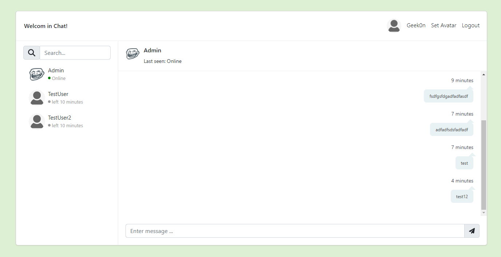

# MKasperczyk.Chat

## Features: 
- Real time chat with others
- Real life online status with time
- Setting avatar (with preview)
- Auth (Login/Register/Logout)
- Contact Searching
- Remembering last chat
- (Technical) keeping connection in database - It is great for distributed systems

## Stack Backend
- C# .NET 6 with minimal api
- SignalR
- Entity Framework
- Postgres 
- (No test yet)

## Stack Frontend
- React
- Bootstrap
- Axios
- (No test yet)